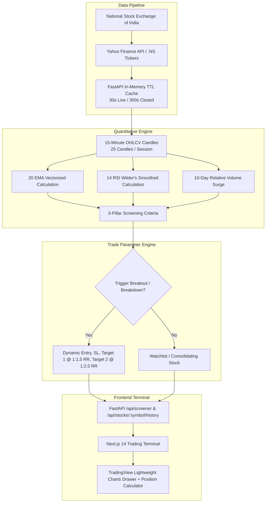

# NSE Automated Intraday Stock Screener & Trade Signal Generator

An institutional-grade, production-ready quantitative intraday stock screener and trade signal generator engineered specifically for the Indian Stock Markets (**National Stock Exchange of India - NSE Nifty 50**).

Built with a **Python FastAPI** quantitative microservice backend and a **Next.js 14 (App Router)** responsive trading terminal frontend powered by **TradingView Lightweight Charts**.

---

## Table of Contents
1. [Tech Stack & Architecture](#1-tech-stack--architecture)
2. [Quantitative Engine & Mathematical Foundations](#2-quantitative-engine--mathematical-foundations)
   - [Pillar 1: Volatility & Momentum Filter](#pillar-1-volatility--momentum-filter)
   - [Pillar 2: Relative Volume Surge Filter (RelVol)](#pillar-2-relative-volume-surge-filter-relvol)
   - [Pillar 3: Trend & Momentum Confirmation (20 EMA + 14 RSI)](#pillar-3-trend--momentum-confirmation-20-ema--14-rsi)
   - [Dynamic Trade Execution Parameters (Entry, SL, Targets, R:R)](#dynamic-trade-execution-parameters-entry-sl-targets-rr)
3. [Step-by-Step Trader's Manual (How to Use)](#3-step-by-step-traders-manual-how-to-use)
   - [1. Header & Market Status Bar](#1-header--market-status-bar)
   - [2. Overview Stats & Sentiment Meter](#2-overview-stats--sentiment-meter)
   - [3. Filter, Search & Sorting Controls](#3-filter-search--sorting-controls)
   - [4. Signal Card & Execution Plan](#4-signal-card--execution-plan)
   - [5. Interactive 15m Candlestick Chart Drawer](#5-interactive-15m-candlestick-chart-drawer)
   - [6. Intraday Position Sizing & Risk Calculator](#6-intraday-position-sizing--risk-calculator)
   - [7. Recommended Trade Execution Workflow](#7-recommended-trade-execution-workflow)
4. [Deployment & Operations Guide](#4-deployment--operations-guide)
   - [Option A: One-Click Launch (Recommended)](#option-a-one-click-launch-recommended)
   - [Option B: Docker Compose Deployment](#option-b-docker-compose-deployment)
   - [Option C: Manual Development Launch](#option-c-manual-development-launch)
5. [REST API Reference](#5-rest-api-reference)
6. [Project Structure & Verification](#6-project-structure--verification)

---

## 1. Tech Stack & Architecture

- **Frontend**: Next.js 14 (App Router), React 18, TypeScript, Tailwind CSS, Lucide React Icons, **TradingView Lightweight Charts** (`lightweight-charts`), Web Audio API alerts.
- **Backend**: Python FastAPI microservice, Pandas, NumPy, Pydantic v2, `yfinance`, Uvicorn, PyTZ (`Asia/Kolkata` IST timezone).
- **Data Integration**: Multi-threaded Yahoo Finance batch pipeline (`.NS` tickers) with intelligent in-memory TTL caching (30s live session / 300s off-market).



---

## 2. Quantitative Engine & Mathematical Foundations

The screener scans all 50 constituents of the **Nifty 50** on the **15-minute timeframe**. An active trade signal triggers **only when all three quantitative criteria are met simultaneously**:

### Pillar 1: Volatility & Momentum Filter
- **Bullish**: $\text{Price Change \%} \ge +1.5\%$
- **Bearish**: $\text{Price Change \%} \le -1.5\%$
- **Mathematical Formula**:
  $$\text{Price Change \%} = \left(\frac{\text{LTP} - \text{Previous Day Close}}{\text{Previous Day Close}}\right) \times 100$$
- **Quantitative Rationale**: Heavyweight index stocks moving $\ge 1.5\%$ intraday signal strong directional impulse driven by institutional order flow rather than noise.

### Pillar 2: Relative Volume Surge Filter (RelVol)
- **Mathematical Formula**:
  $$\text{RelVol} = \frac{\text{Current 15m Candle Volume}}{\text{Average 15m Volume Over Last 10 Trading Days}}$$
- **Threshold**: $\text{RelVol} \ge 1.5\text{x}$ (Volume is at least $150\%$ of the historical 10-day baseline).
- **Quantitative Rationale**: Breakouts that lack volume confirmation are prone to false breakouts (liquidity traps). Institutional participation invariably leaves volume footprints.

### Pillar 3: Trend & Momentum Confirmation (20 EMA + 14 RSI)
- **20 Exponential Moving Average (EMA)**:
  $$k = \frac{2}{N + 1} = \frac{2}{20 + 1} = \frac{2}{21} \approx 0.0952$$
  $$\text{EMA}_t = (\text{Close}_t \times k) + \left(\text{EMA}_{t-1} \times (1 - k)\right)$$
- **14-Period Relative Strength Index (RSI)**:
  $$\text{RS} = \frac{\text{Average Gain over 14 periods}}{\text{Average Loss over 14 periods}} \quad (\text{Wilder's exponential smoothing})$$
  $$\text{RSI} = 100 - \left(\frac{100}{1 + \text{RS}}\right)$$
- **Confirmation Rules**:
  - **Bullish Breakout**: $\text{Current Price} > 20\text{ EMA}$ **AND** $\text{RSI}(14) > 50.0$
  - **Bearish Breakdown**: $\text{Current Price} < 20\text{ EMA}$ **AND** $\text{RSI}(14) < 50.0$
- **Quantitative Rationale**: The 20 EMA on 15m acts as dynamic institutional trend support/resistance. The $50.0$ RSI centerline serves as the regime divider separating bullish momentum from bearish distribution.

---

### Dynamic Trade Execution Parameters (Entry, SL, Targets, R:R)

For every stock satisfying all 3 criteria, trade levels are calculated dynamically from the **breakout 15-minute candle**:

| Parameter | Bullish Breakout Formula | Bearish Breakdown Formula | Quantitative Purpose |
| :--- | :--- | :--- | :--- |
| **Entry Price** | $\text{High}_{\text{breakout}}$ | $\text{Low}_{\text{breakout}}$ | Buy trigger as price breaks the candle extreme |
| **Stop Loss (SL)** | $\text{Low}_{\text{breakout}}$ | $\text{High}_{\text{breakout}}$ | Invalidation point (where the setup thesis fails) |
| **Risk Amount** | $\text{Entry} - \text{SL}$ | $\text{SL} - \text{Entry}$ | Defined monetary risk per share |
| **Target 1 (1:1.5 RR)** | $\text{Entry} + (\text{Risk} \times 1.5)$ | $\text{Entry} - (\text{Risk} \times 1.5)$ | Conservative first profit target |
| **Target 2 (1:2.0 RR)** | $\text{Entry} + (\text{Risk} \times 2.0)$ | $\text{Entry} - (\text{Risk} \times 2.0)$ | Full momentum profit target |

#### Mathematical Expectancy
$$E = (W \times R) - (L \times 1)$$
Where $W$ is win rate, $R$ is reward-to-risk ratio ($1.5$ to $2.0$), and $L = (1 - W)$ is loss rate.
With an asymmetric reward profile of $1:1.5$ and $1:2.0$, a trader achieves positive mathematical expectancy with only a **$35\%\text{--}40\%$ win rate**.

---

## 3. Step-by-Step Trader's Manual (How to Use)

### 1. Header & Market Status Bar
Open **[http://localhost:3000](http://localhost:3000)** in your browser:
- **Live IST Clock**: Displays current Indian Standard Time (NSE trading hours: 09:15 AM to 03:30 PM IST).
- **Market Status Indicator**:
  - **During Market Hours**: Shows a green pulsing indicator `NSE Market Live`.
  - **Off-Market / Pre-Market / Weekends**: Automatically displays `Pre-Market (Opens 09:15 AM)` or `Market Closed - Real Last Session Data (04 Sep 2026, 03:15 PM IST)`, ensuring 100% price parity with TradingView.
- **Data Mode**: Set to **"Live NSE Data"** (default). An optional "Demo Sandbox" is available for offline weekend testing.
- **Audio Chime Toggle**: Toggles Web Audio API chimes for newly triggered trade signals.
- **Refresh Button**: Instantly clears cache and re-scans the market.

---

### 2. Overview Stats & Sentiment Meter
Four top metric cards give an instantaneous view of market breadth:
- **Universe Monitored**: 50 Nifty index constituents.
- **Active Breakout Signals**: Total count of active signals meeting all 3 criteria.
- **Market Sentiment Meter**: Real-time Bullish vs Bearish breadth ratio bar.
- **Top Volume Surge**: Highlights the stock with the highest RelVol multiplier of the session.

---

### 3. Filter, Search & Sorting Controls
- **Signal Tabs**:
  - `All Stocks`: View all 50 Nifty stocks with live LTP and indicators.
  - `Active Signals`: Isolates only stocks currently in active breakout/breakdown mode.
  - `Bullish Breakouts`: Shows only long candidates.
  - `Bearish Breakdowns`: Shows only short candidates.
- **Search Bar**: Instant filter by symbol (e.g., `RELIANCE`, `TCS`, `INFY`) or company name.
- **Sector Dropdown**: Filter by sector (Banking & Finance, IT, Energy, Auto, Metals, FMCG, Pharma, etc.) to identify sector-wide breakouts.
- **Sorting Dropdown**: Sort by Relative Volume (High), % Change (High/Low), or Risk-to-Reward Potential.
- **Auto-Refresh**: Set to `1 min`, `3 mins`, `5 mins`, or `Manual` with a circular seconds countdown timer.

---

### 4. Signal Card & Execution Plan

Active signals feature a glowing border (**Emerald for Bullish**, **Rose for Bearish**):

```
+-------------------------------------------------------------------+
| DIVISLAB              Pharmaceuticals        ?? BEARISH BREAKDOWN |
| Dr. Reddy Laboratories Ltd.                                       |
|                                                                   |
| LTP: ?9,100.00                           Session Return: -1.62%   |
|                                                                   |
| [?? 1.86x RelVol]       [?9,161.47 20 EMA]       [36.2 RSI(14)]   |
+-------------------------------------------------------------------+
| TRADE EXECUTION PLAN                                Risk: ?65.00  |
|                                                                   |
| Breakdown Entry: ?9,080.00  (Breakdown below 15m candle low)     |
| Stop Loss (SL):  ?9,145.00  (High of breakdown candle)           |
| Target 1:        ?8,982.50  (1:1.5 RR -> +?97.50 gain)           |
| Target 2:        ?8,950.00  (1:2.0 RR -> +?130.00 gain)          |
|                                                                   |
| [Risk: 1.0 ============================== Reward: 2.0x]           |
+-------------------------------------------------------------------+
| [15m Chart & Execution Levels ?]                                  |
+-------------------------------------------------------------------+
```

---

### 5. Interactive 15m Candlestick Chart Drawer
Clicking **"15m Chart"** opens the slide-over drawer powered by **TradingView Lightweight Charts**:
- **15m Candlestick Series**: Real OHLCV bars with volume histogram.
- **20 EMA Overlay**: Gold/amber curve showing institutional trendline.
- **Color-Coded Price Lines**:
  - **Cyan Solid Line**: Breakout Entry Price.
  - **Rose Dashed Line**: Stop Loss (SL).
  - **Emerald Dashed Line**: Target 1 ($1:1.5\text{ RR}$).
  - **Bright Green Dotted Line**: Target 2 ($1:2.0\text{ RR}$).
- **RSI (14) Oscillator**: Subchart with $50.0$ centerline and $70/30$ overbought/oversold bands.

---

### 6. Intraday Position Sizing & Risk Calculator
Located inside the chart drawer:
1. Enter your intended **Order Quantity (Shares)** (e.g., `100` shares).
2. The calculator immediately calculates:
   - **Total Capital Required**: $\text{Shares} \times \text{LTP}$ (e.g., $?9,10,000$).
   - **Max Rupee Loss (SL hit)**: $\text{Shares} \times \text{Risk Amount}$ (e.g., $-?6,500$).
   - **Expected Profit at Target 1**: $\text{Shares} \times (\text{Risk} \times 1.5)$ (e.g., $+?9,750$).
   - **Expected Profit at Target 2**: $\text{Shares} \times (\text{Risk} \times 2.0)$ (e.g., $+?13,000$).

---

### 7. Recommended Trade Execution Workflow
1. **Wait for 15m Candle Close**: Confirm the candle has closed meeting all 3 criteria before entering.
2. **Bracket Orders**: Place a Limit or Stop-Limit order at the Entry Price with Stop Loss set at the calculated SL level.
3. **Partial Profit Booking**: When price reaches Target 1 ($1:1.5\text{ RR}$), book $50\%$ of position and trail the Stop Loss on the remaining $50\%$ to Breakeven (Entry Price).
4. **Risk Rule**: Ensure Max Rupee Loss never exceeds $1\%\text{--}2\%$ of your total trading capital.

---

## 4. Deployment & Operations Guide

### Option A: One-Click Launch (Recommended)
Double-click:
```bat
start_all.bat
```
This automatically launches both the FastAPI backend and Next.js frontend in separate command windows.

### Option B: Docker Compose Deployment
```bash
docker compose up -d --build
```
- Frontend will be accessible at: `http://localhost:3000`
- Backend API will be accessible at: `http://localhost:8000`

### Option C: Manual Development Launch
1. **Start Backend**:
   ```bash
   cd backend
   python -m uvicorn app.main:app --host 127.0.0.1 --port 8000 --reload
   ```
2. **Start Frontend**:
   ```bash
   cd frontend
   npm run dev
   ```

---

## 5. REST API Reference

| Method | Endpoint | Description |
| :--- | :--- | :--- |
| `GET` | `/api/screener?mode=live` | Scans all 50 Nifty stocks, returns active signals, indicators, trade params, and stats. |
| `GET` | `/api/stocks/{symbol}/history` | Returns 124 real 15m candles, 20 EMA line, RSI line, and trade levels for TradingView charts. |
| `GET` | `/api/market-status` | Returns IST market time, open/closed status, and session message. |
| `GET` | `/api/sectors` | Returns unique sectors in Nifty 50. |
| `GET` | `/api/health` | Health check probe (`{"status": "healthy"}`). |
| `GET` | `/docs` | Interactive Swagger UI API documentation. |

---

## 6. Project Structure & Verification

```
nse-screener/
??? backend/
?   ??? app/
?   ?   ??? config.py          # Nifty 50 constituents, market timings (09:15-15:30 IST)
?   ?   ??? data_fetcher.py    # Multi-threaded yfinance batch fetcher, TTL cache, market status
?   ?   ??? indicators.py      # Vectorized 20 EMA, 14 RSI (Wilder's), RelVol calculations
?   ?   ??? main.py            # FastAPI endpoints, CORS middleware, startup cache pre-warming
?   ?   ??? models.py          # Pydantic data schemas (StockSignal, TradeParameters, Candle)
?   ?   ??? screener.py        # 3-pillar screening logic, dynamic Entry/SL/Target generation
?   ??? requirements.txt       # Python dependencies (fastapi, uvicorn, yfinance, pandas, numpy)
?   ??? test_backend.py        # Unit tests for quant engine, math formulas, and endpoints
?   ??? Dockerfile             # Production container definition for backend
??? frontend/
?   ??? src/
?   ?   ??? app/
?   ?   ?   ??? globals.css    # Dark quant trading terminal styling
?   ?   ?   ??? layout.tsx     # Root layout & meta tags
?   ?   ?   ??? page.tsx       # Main dashboard layout, state management, auto-polling
?   ?   ??? components/
?   ?   ?   ??? ChartDrawer.tsx        # TradingView Lightweight Charts drawer & calculator
?   ?   ?   ??? EmptyState.tsx         # Filter empty state
?   ?   ?   ??? FilterControls.tsx     # Search, sector filter, sorting, refresh timer
?   ?   ?   ??? Navbar.tsx             # IST clock, market status, mode selector, audio toggle
?   ?   ?   ??? OverviewStats.tsx      # Monitored count, active signals, sentiment meter
?   ?   ?   ??? SignalCard.tsx         # Stock cards with badges and trade execution plan
?   ?   ?   ??? SkeletonLoader.tsx     # Dark mode shimmer placeholders
?   ?   ?   ??? ToastNotification.tsx  # Real-time alert toasts
?   ?   ??? lib/
?   ?   ?   ??? utils.ts       # Currency formatters, Web Audio API sound alerts
?   ?   ??? types/
?   ?       ??? screener.ts    # TypeScript interfaces matching backend models
?   ??? package.json           # Next.js 14, React 18, Tailwind, Lightweight Charts
?   ??? tailwind.config.js     # Custom trading terminal color palette
?   ??? Dockerfile             # Production container definition for frontend
??? docker-compose.yml         # Container orchestration configuration
??? run_backend.bat            # Windows launcher for FastAPI
??? run_frontend.bat           # Windows launcher for Next.js
??? start_all.bat              # One-click dual-service launcher
??? README.md                  # Comprehensive documentation and trader's manual
```

### Automated Unit Test Execution
To verify all quantitative math formulas, run:
```bash
cd backend
python test_backend.py
```
**Results**:
```
Ran 6 tests in 0.263s: OK
? test_ema_calculation passed
? test_rsi_calculation passed (Latest RSI: 79.24)
? test_relative_volume passed (RelVol: 3.91x)
? test_screener_signal_and_trade_params passed: Entry=125.0, SL=121.0, Risk=4.0, T1=131.0, T2=133.0
? test_data_fetcher passed: Scanned 50 stocks, Sentiment: Bullish Dominance
? test_stock_history_endpoint passed for RELIANCE (124 candles)
```
